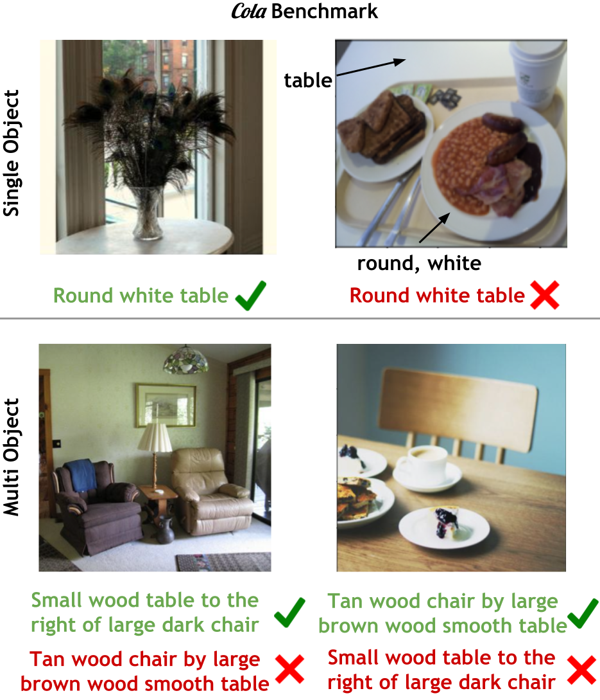

# COLA: How to adapt vision-language models to Compose Objects Localized with Attributes?




Project page: https://cs-people.bu.edu/array/research/cola/ 

Paper: https://arxiv.org/abs/2305.03689


## COLA Data

### Multi-objects setting
The `data/COLA_multiobjects_matching_benchmark.json` file conatins the multi-objects setting validation. 

The json file contains data like:
`[link to image 1, caption 1, link to image 2, caption 2]`

The image links are in the format: https://cs-people.bu.edu/array/data/vg_gqa_images/2414605.jpg. `2414605` is the visual genome id.

The image 1 and image 2 have attributes and objects that are swapped in the captions.

Caption 1 applies to image 1 and not to image 2, and vice versa. 


### Single Objects setting

- `data/COLA_singleobjects_benchmark_GQA.json` contains the single-objects setting validation data for GQA.
- `data/COLA_singleobjects_benchmark_CLEVR.json` contains the single-objects setting validation data for CLEVR.
- `data/COLA_singleobjects_benchmark_PACO.json` contains the single-objects setting validation data for PACO.

The JSON contains two keys: `labels` and `data`. 

The `labels` contains the names of the 320 multi-attribute object classes for the benchmark.

The `data` is a list with each entry in the format:

`[image_file, objects_attributes_annotation, label, hard_list]`

- `image_file`: Path to Visual Genome Image
- `objects_attributes_annotation`: a dictionary of the objects in the image along with the attributes. This is absent for the PACO verson.
- `label`: `0` or `1` label of whether each of the 320 classes in the `labels` is present in the image or not. 
- `hard_list`: `0` or `1` label of whether the image is counted within a difficult set for each of the 320 class labels. 
For instance, if a class label is "square white plate", a hard image could be a images with something white or square or plate. Rsults in the main COLA paper are on this hard set of images. 
Measure MAP on the set of images with this label as 1 for each class for measuring the COLA paper MAPs. Example code below. 


## COLA Eval

Refer to `scripts/eval.py` to see how to evaluate your model on our data with our metrics. 


## Our best adaptation method

We see that compositional performance improves most when you tune a multimodal transformer layer on top of CLIP's frozen embeddings. Here is a code example to do that (this should work with the huggingface CLIP). 

```python
class CLIP_adaptation(nn.Module):
    def __init__(self, args):
        super().__init__()
        self.model = CLIPModel.from_pretrained("openai/clip-vit-base-patch32")

        self.model.eval()
        for p in self.model.parameters():
            p.requires_grad = False
        
        self.positional_encoding = PositionalEncoding(512, 0.1, 100)

        self.transformer_block = nn.Transformer(
            nhead=4,
            num_encoder_layers=1,
            num_decoder_layers=1,
            batch_first=True,
        )

        self.vision_linear = nn.Linear(768, 512)

        self.proposals = nn.Parameter(torch.rand(1, 1, 512))

    def forward(
        self,
        input_ids,
        attention_mask,
        pixel_values,
    ):

        outputs = self.model(
            input_ids=input_ids,
            attention_mask=attention_mask,
            pixel_values=pixel_values,
            output_hidden_states=True,
        )

        image_embeds = outputs.vision_model_output.hidden_states[-2]
        vision_feats_projected = self.vision_linear(image_embeds)
        # this is im_batch_size x 50 x 512 (50 is the number of image tokens for 1 CLS and 7x7 patches)

        
        text_token_feats = outputs.text_model_output.hidden_states[-2]
        # this is text_batch_size x seq_len x 512

        text_feats = text_token_feats 

        # repeat the vision feats text_batch times in an interleaved manner.
        # this means repeat [1,2,3] as [1,1,2,2,3,3]
        text_batch = text_feats.shape[0]
        vision_feats_repeated = vision_feats_projected[:, 1:, :].repeat_interleave(
            text_batch, dim=0
        )

        # repeat the text feats image batch times normally.
        # this means, repeat [1,2] as [1,2,1,2,1,2]
        im_batch = vision_feats_projected.shape[0]
        text_feats_repeated = text_feats.repeat([im_batch, 1, 1])

        # this creates a batch of every image paired with every text
        concat_feats = torch.cat(
            (
                vision_feats_repeated,
                text_feats_repeated,
            ),
            dim=1,
        )

        proposals_repeated = self.proposals.repeat([im_batch * text_batch, 1, 1])
        transformer_enc_out = self.transformer_block(concat_feats, proposals_repeated)

        vision_feats_repeated = transformer_enc_out[:, :, :]

        
        text_feats_swapped = torch.swapaxes(text_feats_repeated, 1, 2)
        improposal_token_sim = torch.bmm(vision_feats_repeated, text_feats_swapped)
        # this is imbatch*txtbatch x 49 x seq_len

        
        atten_mask_repeated = attention_mask.repeat([im_batch, 1])

        end_inds = torch.sum(atten_mask_repeated, dim=1)
        atten_mask_repeated[:, 0] = 0
        atten_mask_repeated[
            torch.range(0, atten_mask_repeated.shape[0] - 1).long(),
            (end_inds - 1).long(),
        ] = 0

        # atten is now imbatch*txtbatch x seq_len
        improp_token_masked = improposal_token_sim * atten_mask_repeated.unsqueeze(1)
        # this is still imbatch*txtbatch x 49 x seq_len with 0's in the masked tokens

        improp_scores = torch.sum(improp_token_masked, dim=-1) / torch.sum(
            atten_mask_repeated, dim=-1
        ).unsqueeze(1)
        # this is imbatch*txtbatch x 49

        # now pick the improp that has the max score.
        scores = torch.max(improp_scores, dim=-1)

        scores = scores.values.view((pixel_values.shape[0], -1))
        scores = torch.nan_to_num(scores)

        # this should return scores of shaoe num_images x num_text
        return {
            "scores": scores,
        }
```
